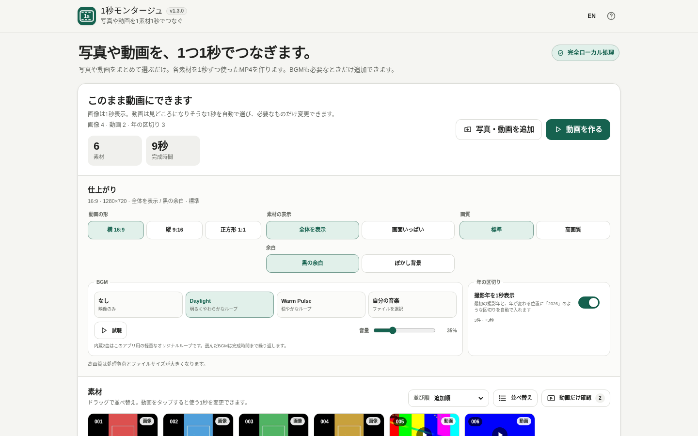

# 1秒モンタージュ

[](https://github.com/ttomohisa/htmlapps-one-second-montage/actions/workflows/deploy-pages.yml)
[](LICENSE)
[](https://ttomohisa.github.io/htmlapps-one-second-montage/)

[English README](README.md)

写真と動画をまとめて読み込み、**1素材につき1秒**でつないだMP4を作る単一HTMLアプリです。必要なときだけBGMと撮影年の1秒区切りを追加できます。選択したファイルは端末内で処理し、このアプリから外部サーバーへアップロードしません。

## 🚀 デモ

### [GitHub Pagesで1秒モンタージュを開く](https://ttomohisa.github.io/htmlapps-one-second-montage/)

GitHub Pagesから最初のHTMLを読み込んだ後、ファイル読み込み・サムネイル生成・動画の1秒位置選択・描画・プレビュー・MP4生成はブラウザー内で行います。選択した写真や動画をアプリがサーバーへ送信することはありません。

[](https://ttomohisa.github.io/htmlapps-one-second-montage/)

## 主な機能

- **1素材 = 1秒** — 写真は1秒表示し、動画は1秒だけ使用します。動画は明るさ・画面の変化・情報量を端末内で軽く確認し、見どころになりそうな1秒を自動選択します。判定が弱い場合は中央1秒を使います。
- **写真と動画をまとめて追加** — JPEG / PNG / WebP / MP4 / WebMを同じ一覧で扱えます。MOV / M4Vもブラウザーが再生できる場合は利用できます。
- **必要なところだけ調整** — 並べ替え、削除とUndo、**動画だけ確認**、動画の使う1秒の変更だけを用意し、複雑なタイムライン編集は行いません。
- **仕上がりをシンプルに選択** — 横16:9 / 縦9:16 / 正方形1:1、全体を表示 / 画面いっぱい、標準 / 高画質を選べます。全体を表示では、黒の余白とぼかし背景も選べます。
- **BGMを1曲だけ追加** — 軽量な内蔵オリジナルループ2曲、または自分の音楽ファイルから1曲を選べます。完成時間まで自動でループし、素材動画の元音声は使用しません。
- **撮影年の自動区切り** — 有効にすると、現在の並び順に沿って最初の撮影年と年が変わる位置へ `2024` / `2025` のような1秒カードを自動挿入します。
- **完成動画を残したまま再調整** — 素材・順番・動画位置・仕上がりを変更しても完成済みMP4は消えません。**動画を作り直す**ときだけ確認して置き換えます。
- **完全ローカル処理の単一HTML** — アカウント、アップロードAPI、実行時CDN、analytics、telemetryは不要です。日本語 / 英語、PC / スマートフォンに対応します。

## すぐに使う

### Webで使う

[デモを開く](https://ttomohisa.github.io/htmlapps-one-second-montage/)だけで利用できます。インストールやアカウント登録は不要です。

### HTMLをダウンロードして使う

1. リポジトリから [`dist/index.html`](https://github.com/ttomohisa/htmlapps-one-second-montage/blob/main/dist/index.html) をダウンロードします。
2. 現行のChromeまたはEdgeで直接開きます。

ローカルWebサーバーは不要で、HTML単体で起動できます。

### 自分でビルドする（上級者向け）

1. Windowsでこのリポジトリをダウンロードまたはクローンします。
2. `build-standalone.bat` を実行します。
3. `dist/index.html` が読みやすい単一HTML版として生成されます。
4. `DecompressionStream` 対応ブラウザー向けに、より小さい `dist/index.self-extract.html` も生成されます。

現在のアプリはサードパーティの実行時ライブラリを内包していません。ビルドにPython、Node.js、ローカルサーバーは不要で、Windows PowerShellと標準ツールを利用します。

## 使い方

1. 写真と動画をファイル選択またはドラッグ＆ドロップでまとめて追加します。
2. 素材数と完成時間を確認します。各素材は1秒で、年の区切りを有効にした場合は区切り1件につき1秒が追加されます。
3. **追加順 / 撮影日時順 / ファイル名順**を選ぶか、**並べ替え**で好きな順番にします。
4. 自動選択できた動画には **おすすめ1秒** と表示します。使う場所を変えたいときだけ動画カードを選び、**1秒を再生**で使用部分だけ確認できます。
5. 不要な素材はカードから削除します。削除直後は**元に戻す**ことができます。
6. 必要なら、仕上がりの動画の形・素材の表示・Fit時の背景・画質を変更します。
7. 必要なら内蔵BGMまたは自分の音楽を1曲選び、音量を調整します。撮影年の1秒区切りもここで有効にできます。
8. **動画を作る**を押し、生成が完了するまで待ちます。
9. 完成動画をプレビューし、必要ならファイル名を変更して**MP4を保存**します。
10. 完成後に編集を続けても現在のMP4は残ります。反映したいときだけ**動画を作り直す**を押し、置き換えを確認します。

### 出力プリセット

| 動画の形 | 標準 | 高画質 |
| --- | ---: | ---: |
| 横 16:9 | 1280×720 | 1920×1080 |
| 縦 9:16 | 720×1280 | 1080×1920 |
| 正方形 1:1 | 720×720 | 1080×1080 |

**全体を表示**では素材全体を残します。余白部分は **黒の余白** または **ぼかし背景** を選べます。**画面いっぱい**では画面を埋めるように拡大し、はみ出した部分を中央基準で切り取ります。素材動画の元音声は完成動画には入りません。BGMを選んだ場合は、その1曲だけを完成時間までループして追加します。

### 並び順と撮影日時

- PCでは素材カードの並べ替えハンドルをドラッグします。
- スマートフォンではカード右下のハンドルを動かすか、専用の**並べ替え**画面から上下ボタンで移動します。
- 撮影日時順と年の区切りはJPEGの撮影日時、MP4 / MOVの作成日時を優先し、取得できない場合はファイルの `lastModified` を使います。
- 年の区切りは現在の素材順に沿って入ります。区切りを有効にしても素材自体を自動で並べ替えません。

### キーボード操作

- `Tab` / `Shift+Tab` で操作項目を移動できます。
- 動画カードで `Enter` / `Space` を押すと1秒位置の調整画面を開けます。
- 矢印キーで1秒の開始位置を変更できます。
- `Esc` でダイアログを閉じられます。

## GitHub Pagesで公開する

このリポジトリには、単一HTMLを再生成して `dist/` をGitHub Pagesへ公開するワークフローが含まれています。

1. `htmlapps-one-second-montage` としてGitHubへプッシュします。
2. **Settings → Pages → Build and deployment → Source** で **GitHub Actions** を選択します。
3. `main` へプッシュするか、Actions画面から **Deploy standalone app to GitHub Pages** を実行します。
4. 成功後、`https://ttomohisa.github.io/htmlapps-one-second-montage/` で利用できます。

公開前にstandalone / self-extract生成、CSP、必須release assets、未置換placeholderなどのリポジトリ検査を実行します。

## 開発とビルド

```text
.
├─ src/index.template.html       # アプリ本体のソーステンプレート
├─ assets/
│  ├─ favicon.svg                # ブラウザー / アプリアイコン
│  ├─ screenshot.png             # 日本語スクリーンショット
│  └─ screenshot-en.png          # 英語スクリーンショット
├─ app.config.json               # アプリ情報とビルド設定
├─ dependencies.json             # 内包依存定義（現在は空）
├─ build-standalone.bat          # Windows用ビルド入口
├─ build-standalone.ps1          # 単一HTMLビルダー
├─ dist/
│  ├─ index.html                 # 読みやすい単一HTML版
│  └─ index.self-extract.html    # 圧縮self-extract版
└─ .github/workflows/
   ├─ build-standalone.yml       # Pull Request時の検証
   ├─ deploy-pages.yml           # GitHub Pages公開
   └─ dependency-updates.yml     # 依存更新チェック
```

編集対象は `src/index.template.html` です。`dist/` の生成HTMLは直接編集しません。

### ビルド検査

`scripts/check-repository.ps1` では、standalone / self-extract、CSPと通信ポリシー、favicon、スクリーンショット、未置換placeholderなどを確認します。

依存更新Workflowは、`dependencies.json` に設定したライブラリへ新しいバージョンがある場合にGitHub Issueを作成・更新します。現在のv1.3ではサードパーティJavaScriptライブラリを内包していません。

## プライバシーと外部通信

このアプリは**完全ローカル処理**を前提にしています。

- 選択した写真・動画・自分で選んだ音楽はブラウザー内で読み込み、このアプリから外部へアップロードしません。
- 生成MP4を自動送信する処理はなく、**MP4を保存**したときだけ端末へ書き出します。
- 生成HTMLには `connect-src 'none'` を含むContent Security Policyを設定しています。
- 実行時CDN、analytics、telemetryは使用しません。
- 大量素材では縮小サムネイルを使い、動画生成時は現在の素材と次の1素材だけを上限に先読みし、使い終わった素材はすぐ解放します。

GitHub Pages版では最初のHTML配信のための通信は発生します。ネットワークを切った状態で使う場合は、生成済みの `dist/index.html` をローカルで直接開いてください。

## 制限事項

- MP4生成にはブラウザーの `MediaRecorder` MP4出力と `canvas.captureStream()` が必要です。主対象は現行Chrome / Edgeです。
- 動画入力はブラウザーがその動画のcodecを再生できる必要があり、拡張子だけでは処理可否を保証できません。
- 見どころ1秒は内容を理解するAIではなく、明るさ・画面変化・情報量を使った軽量な候補選択です。明確な候補がない場合は中央1秒を使い、どの動画も手動で変更できます。
- 現在の動画生成はブラウザーで実時間録画するため、完成動画とおおむね同程度の処理時間がかかります。
- 素材動画の元音声は意図的に使用しません。BGMは1曲をループするだけで、複数トラックのミックスや曲の開始位置編集は行いません。
- 自分の音楽はブラウザーがデコードできる音声形式に依存します。大きな音声はメモリを使うため、UIでは50 MBを上限にしています。
- トランジション、自由なテロップ、エフェクト、フィルター、複数トラック、素材ごとの自由な秒数設定は現時点の対象外です。
- 大量素材、4K動画、高画質出力では端末メモリを多く使う場合があります。読み込み・動画作成は途中でキャンセルでき、追加済みの利用可能な素材は保持されます。

## 使用ライブラリ

現在のv1.3はサードパーティの実行時JavaScriptライブラリを内包していません。File API、Canvas、HTMLMediaElement、Web Audio API、MediaRecorder、Pointer Events、Web WorkerなどのブラウザーAPIを直接利用しています。

リポジトリやWorkflowの通知事項は [THIRD_PARTY_NOTICES.md](THIRD_PARTY_NOTICES.md) を確認してください。

## コントリビューション

バグ報告や機能提案はGitHub Issuesからお願いします。開発への参加方法は [CONTRIBUTING.md](CONTRIBUTING.md) を確認してください。

## ライセンス

Copyright © 2026 ttomohisa

このプロジェクトは [MIT License](LICENSE) で公開されています。
