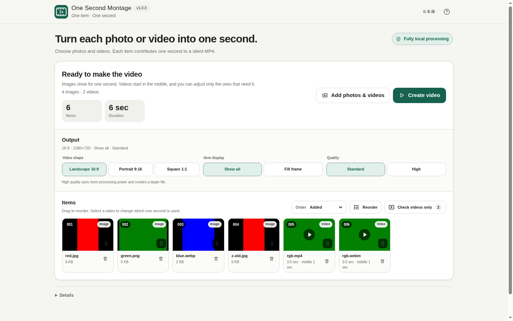

# One Second Montage

[](https://github.com/ttomohisa/htmlapps-one-second-montage/actions/workflows/deploy-pages.yml)
[](LICENSE)
[](https://ttomohisa.github.io/htmlapps-one-second-montage/)

[日本語版 README](README.ja.md)

A single-HTML browser app that turns mixed photos and videos into a silent MP4 montage using **exactly one second per item**. Selected files are processed locally on the device and are not uploaded by the app.

## 🚀 Live demo

### [Open One Second Montage on GitHub Pages](https://ttomohisa.github.io/htmlapps-one-second-montage/)

GitHub Pages delivers the initial HTML. After it loads, file reading, thumbnails, clip selection, rendering, preview, and MP4 creation run locally in the browser. The photos and videos you select are not uploaded by the app.

[](https://ttomohisa.github.io/htmlapps-one-second-montage/)

## Features

- **One item, one second** — Every photo contributes one second. Every video contributes a single one-second window, with the middle second selected automatically at first.
- **Photos and videos in one batch** — Mix JPEG, PNG, WebP, MP4, and WebM files, then review them in one thumbnail grid. MOV / M4V also work when the browser can decode them.
- **Edit only what needs attention** — Reorder items, remove/undo items, use **Check videos only**, and move a video's one-second window without opening a full timeline editor.
- **Simple output choices** — Export landscape 16:9, portrait 9:16, or square 1:1; choose whole-item Fit or centered Fill; and use standard or high-quality resolution presets.
- **Keep the last result while adjusting** — Changing items, order, clip positions, or output settings does not erase the finished MP4. **Recreate video** asks before replacing it.
- **Fully local, single-HTML operation** — No account, upload API, CDN runtime, analytics, or telemetry. Japanese / English UI and desktop / phone layouts are included.

## Quick start

### Use the web demo

Just [open the demo](https://ttomohisa.github.io/htmlapps-one-second-montage/). No installation or account is required.

### Use the downloaded HTML

1. Download [`dist/index.html`](https://github.com/ttomohisa/htmlapps-one-second-montage/blob/main/dist/index.html) from this repository.
2. Open it directly in a current Chrome or Edge browser.

The file is self-contained and does not require a local web server.

### Build it yourself (advanced)

1. Download or clone this repository on Windows.
2. Run `build-standalone.bat`.
3. Use the generated `dist/index.html` as the readable single-file app.
4. `dist/index.self-extract.html` is also generated as a smaller self-extracting variant for browsers that support `DecompressionStream`.

The current app has no bundled third-party runtime libraries. Python, Node.js, and a local server are not required for the build; the template uses Windows PowerShell and built-in tooling.

## Usage

1. Add photos and videos together with the file picker or drag and drop.
2. Check the item count and finished duration. One item always equals one second.
3. Choose **Added**, **Date taken**, or **Filename**, or use **Reorder** for a custom sequence.
4. Select a video when you want to change its one-second window. Use **Play 1 second** to preview only the selected part.
5. Remove unwanted items from their cards. **Undo** is available briefly after removal.
6. If needed, choose the video shape, item display mode, and quality preset.
7. Select **Create video** and wait for the montage to render.
8. Preview the result, edit the filename if needed, and select **Save MP4**.
9. If you continue editing afterward, the existing MP4 remains available. Select **Recreate video** and confirm only when you want to replace it.

### Output presets

| Shape | Standard | High quality |
| --- | ---: | ---: |
| Landscape 16:9 | 1280×720 | 1920×1080 |
| Portrait 9:16 | 720×1280 | 1080×1920 |
| Square 1:1 | 720×720 | 1080×1080 |

**Show whole item** keeps the full source visible and uses black padding where needed. **Fill frame** fills the output and crops overflow from the center. Source-video audio is not included in the result.

### Ordering and dates

- Desktop: drag the reorder handle on item cards.
- Phone: use the dedicated reorder view and its up/down controls.
- Date-taken sorting prefers JPEG capture metadata and MP4 / MOV creation metadata, then falls back to the file's `lastModified` value.

### Keyboard operation

- Use `Tab` / `Shift+Tab` to move through controls.
- Press `Enter` / `Space` on a video card to open its one-second selector.
- Use the arrow keys to adjust the one-second start position.
- Press `Esc` to close dialogs.

## Publish with GitHub Pages

The repository includes a workflow that rebuilds the standalone HTML and deploys `dist/` to GitHub Pages.

1. Push the repository to GitHub as `htmlapps-one-second-montage`.
2. Open **Settings → Pages → Build and deployment → Source** and select **GitHub Actions**.
3. Push to `main`, or manually run **Deploy standalone app to GitHub Pages** from the Actions tab.
4. After a successful deployment, the app is available at `https://ttomohisa.github.io/htmlapps-one-second-montage/`.

The workflow runs the repository checks before deployment, including standalone/self-extract generation, CSP checks, required release assets, and unresolved-placeholder validation.

## Development and build layout

```text
.
├─ src/index.template.html       # Application source template
├─ assets/
│  ├─ favicon.svg                # App / browser icon
│  ├─ screenshot.png             # Japanese screenshot
│  └─ screenshot-en.png          # English screenshot
├─ app.config.json               # App metadata and build settings
├─ dependencies.json             # Embedded dependency declaration (currently empty)
├─ build-standalone.bat          # Windows build entry point
├─ build-standalone.ps1          # Standalone builder
├─ dist/
│  ├─ index.html                 # Readable single-HTML app
│  └─ index.self-extract.html    # Compressed self-extracting HTML
└─ .github/workflows/
   ├─ build-standalone.yml       # Pull request validation
   ├─ deploy-pages.yml           # GitHub Pages deployment
   └─ dependency-updates.yml     # Scheduled dependency check
```

Edit `src/index.template.html`, not the generated HTML in `dist/`.

### Build checks

`scripts/check-repository.ps1` verifies the repository and generated artifacts, including the standalone build, self-extract build, CSP/network policy, favicon, screenshots, and unresolved placeholders.

The dependency-update workflow creates or refreshes a GitHub Issue when a configured dependency has a newer version. The current app does not bundle a third-party JavaScript library.

## Privacy and runtime network protection

The app is designed for fully local processing:

- Selected photos and videos are read in the browser and are not uploaded by the app.
- The generated MP4 is not sent anywhere automatically; it is written only when you choose **Save MP4**.
- The generated HTML uses a Content Security Policy with `connect-src 'none'`.
- Runtime CDN scripts, analytics, and telemetry are not included.
- Reduced thumbnails and one-at-a-time source decoding are used to limit memory pressure for larger batches.

The GitHub Pages version still requires the initial HTML request. For use with the network disconnected, open the generated `dist/index.html` directly from disk.

## Limitations

- MP4 creation requires browser support for `MediaRecorder` MP4 output and `canvas.captureStream()`. Current Chrome and Edge are the primary targets.
- Video input depends on codecs the browser can decode. A file extension alone does not guarantee that a video can be processed.
- Creating the montage currently takes roughly as long as the finished video's duration because rendering uses real-time browser recording.
- Source-video audio is intentionally not used.
- Transitions, captions, effects, filters, BGM, multiple tracks, and per-item duration editing are intentionally outside the v1.0 scope.
- Very large batches, 4K video, or high-quality output can consume substantial device memory. Import and rendering can be cancelled without clearing already imported usable items.

## Dependencies

No third-party runtime JavaScript library is bundled in the current v1.0 build. The app uses browser APIs directly, including File API, Canvas, HTMLMediaElement, MediaRecorder, Pointer Events, and Web Workers.

See [THIRD_PARTY_NOTICES.md](THIRD_PARTY_NOTICES.md) for repository and workflow notices.

## Contributing

Bug reports and feature proposals are welcome through GitHub Issues. See [CONTRIBUTING.md](CONTRIBUTING.md) for development guidance.

## License

Copyright © 2026 ttomohisa

Licensed under the [MIT License](LICENSE).
